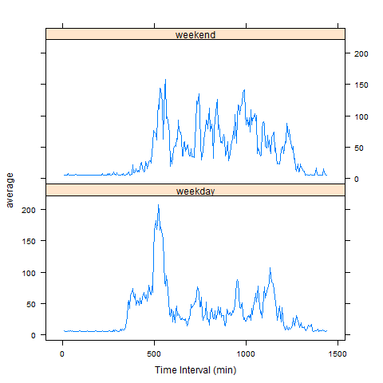

```{r loadingLib,echo =FALSE, results='hide', message=FALSE, warning=FALSE}
library(dplyr)
library(ggplot2)
library(lattice)
library(stringr)
library(reshape2)
library(markdown)
library(knitr)
```

### 1. Total number of steps taken each day 
```{r plot1, echo=FALSE}
oriData <- read.csv("activity.csv", stringsAsFactors =FALSE )
oriData <- data.frame(curr_dt=as.Date(oriData$date,"%Y-%m-%d"), interval=str_pad(oriData$interval,4,"left","0"), steps= as.numeric(oriData$steps), stringsAsFactors =FALSE )

stepsNoNas <- subset(oriData, steps >= 0  )
stepsNoNas <-
  stepsNoNas %>%
  group_by(curr_dt) %>%
  summarize(total_steps = sum(steps, na.rm =TRUE), v_mean = mean(steps, na.rm =TRUE), v_med=median(steps, na.rm =TRUE), na_steps=sum(is.na(steps)) )

noNasMean   <- round(mean(stepsNoNas$total_steps),2)
noNasMedian <- round(median(stepsNoNas$total_steps),2)

## Plotting
hist( stepsNoNas$total_steps, col="steelblue", breaks = 20,  xlab = "", main="",  ylim=c(0,20) )
abline(v=noNasMean,  col="magenta",lwd=3)
abline(v=noNasMedian, col="green", lwd=2)
legend("topright", y.intersp=1.2, lty=1, col = c("green","magenta"), cex =0.8, legend = c(paste(" Median =", noNasMedian), paste("Average =", noNasMean) ) ) 
title(main="Steps Distribution ( excluding missing values)", xlab = "Total Daily Steps")
```

#### Mean and median number of steps taken each day shown in legend above.

### 2. Time series plot of the average number of steps taken
```{r plot2, echo=FALSE}
meltSteps <- melt(oriData, id=c("interval"), measure.vars=c("steps"))
meltSteps <- meltSteps [ complete.cases(meltSteps),]
castSteps <- dcast(data = meltSteps, interval ~variable, mean)

# convert the interval column to time format ( date will be the current date)
castSteps <- data.frame(Time = strptime(castSteps$interval,format("%H%M")), steps=castSteps$steps)
# max values to be displayed on plot
maxStepsCoord <- castSteps [ grep( max(castSteps$steps), castSteps$steps),]
endIntvTime <- sub(Sys.Date(),"",maxStepsCoord[1,1])
begIntvTime <- sub(Sys.Date(),"",maxStepsCoord[1,1] - 300)
maxPlotSteps <- round(maxStepsCoord[1,2], 2)

# plotting
plot(castSteps$Time, castSteps$steps,  type="l", xlab ="Time", ylab="Average Steps", lab =c(2, 10, 7) , ylim =c(0, maxPlotSteps +20) )
abline(h= maxStepsCoord[2], col="magenta", lty =2)
abline(v= maxStepsCoord[1], col="magenta", lty =2)
legend("topright", y.intersp=1.2, cex =0.8, legend = c(paste("Max Time Interval = ", paste(begIntvTime,endIntvTime, sep = " - ")), paste("Max Average Steps = ", maxPlotSteps) ) )
```


```{r replaceNA_code, echo=FALSE}
newData <- subset(oriData, steps >= 0  )

stepsDaily <-
  oriData %>%
  group_by(curr_dt) %>%
  summarize(total_steps = sum(steps, na.rm =TRUE), v_mean = mean(steps, na.rm =TRUE), v_med=median(steps, na.rm =TRUE), na_steps=sum(is.na(steps)) )

missedDaily <- subset( stepsDaily, na_steps > 0)

getMissMean <- function ( vdate) {
  allMean <- summary( stepsDaily$v_mean)[4]
  getRow <- missedDaily [ missedDaily$curr_dt == vdate,]
  ifelse( getRow$na_steps == 288, allMean, getRow$v_mean )
}

for ( vCurrDt in missedDaily$curr_dt ) {
  missed_steps <- subset(oriData, is.na(steps) & curr_dt == vCurrDt )
  newSteps <-
    missed_steps %>%
    mutate(steps = getMissMean(vCurrDt))
  newData <- rbind(newData, newSteps)
}

stepsNewDaily <-
  newData %>%
  group_by(curr_dt) %>%
  summarize(total_steps = sum(steps, na.rm =TRUE), v_mean = mean(steps, na.rm =TRUE), v_med=median(steps, na.rm =TRUE), na_steps=100*mean(is.na(steps)) )

oriData <- cbind(new_dt=strptime(paste(oriData$curr_dt, oriData$interval),format("%Y-%m-%d %H%M")), oriData)
newData <- cbind(new_dt=strptime(paste(newData$curr_dt, newData$interval),format("%Y-%m-%d %H%M")), newData)
mrg_data <- merge(oriData, newData, by.x = "new_dt", by.y = "new_dt")
mrg_data <- select (mrg_data, -(curr_dt.y:interval.y)) 
```

### 3. Histogram of the total number of steps taken each day after missing values are inputed
```{r plot3, echo=FALSE}
newData <-                                                            
  mrg_data %>%                                                          
  group_by(curr_dt.x) %>%                                               
  summarise( old_sum = sum(steps.x, na.rm=TRUE), new_sum = sum(steps.y), v_mean = mean(steps.y), v_med=median(steps.y))

corrMean   <- round(mean(newData$new_sum),2)
corrMedian <- round(median(newData$new_sum),2)

hist( newData$new_sum, col="steelblue", breaks = 20,  xlab = "", main="", ylim=c(0,20))
abline(v=corrMean,   col="magenta",lwd=3)
abline(v=corrMedian, col="green", lwd=2)
legend("topright", y.intersp=1.2,lty=1, col = c("green","magenta"),  cex =0.8, legend = c(paste(" Median =", corrMedian), paste("Average =", corrMean) ) ) 
title(main="Steps Distribution ( with correction)", xlab = "Total Daily Steps")
```


```{r part4, echo=FALSE}
mrg_data <- data.frame( new_dt=mrg_data$new_dt, interval=mrg_data$interval.x, steps=mrg_data$steps.y)
weekData <- 
   mrg_data %>%
   mutate( dayOfWeek = weekdays(new_dt) ) %>%
   mutate( weekCat = ifelse(dayOfWeek %in% c("Monday","Tuesday","Wednesday","Thursday","Friday"),"weekday","weekend")) %>%
   mutate( interval = as.numeric(interval)*5)%>%
   select( - new_dt) %>%
   group_by(weekCat, interval ) %>%
   summarize(average = mean(steps))
```

### 4. Average number of steps taken per 5-minute interval across weekdays and weekends
<!-- -->
