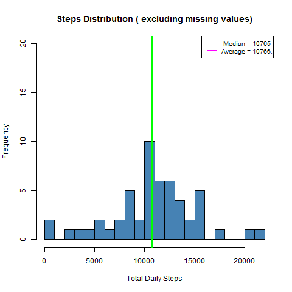
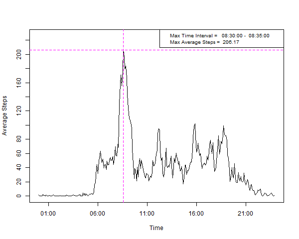
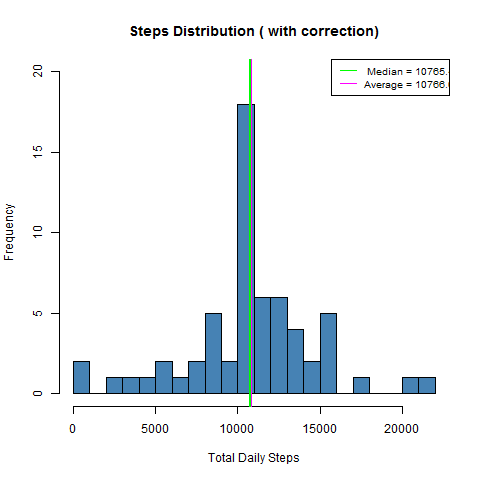
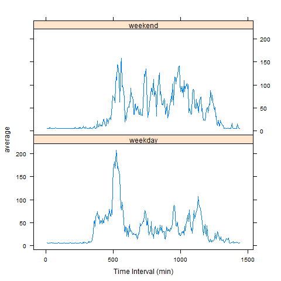

### 1 Loading and preprocessing the data

    v_url <- "https://d396qusza40orc.cloudfront.net/repdata%2Fdata%2Factivity.zip"
    temp <- tempfile()
    download.file(v_url,temp)
    oriData <- read.csv(unz(temp, "activity.csv"))
    unlink(temp)   
    oriData <- read.csv("activity.csv", stringsAsFactors =FALSE )

### 2. What is mean total number of steps taken per day?

#### Mean and median calculated from dataset and reported in plot:

    noNasMean   <- round(mean(stepsNoNas$total_steps),2)
    noNasMedian <- round(median(stepsNoNas$total_steps),2)

<!-- -->

### 3. What is the average daily activity pattern?

<!-- -->

### 4. Inputing missing values

#### Strategy:

##### Uses a function which replaces NAs with previously calculated daily average

    getMissMean <- function ( vdate) {
      allMean <- summary( stepsDaily$v_mean)[4]
      getRow <- missedDaily [ missedDaily$curr_dt == vdate,]
      ifelse( getRow$na_steps == 288, allMean, getRow$v_mean )
    }

##### and allows to generate a dataset restricted to NAs values

    for ( vCurrDt in missedDaily$curr_dt ) {
      missed_steps <- subset(oriData, is.na(steps) & curr_dt == vCurrDt )
      newSteps <-
        missed_steps %>%
        mutate(steps = getMissMean(vCurrDt))
      newData <- rbind(newData, newSteps)
    }

##### Merge NAs restricetd dataset with no NAs Dataset

    oriData <- cbind(new_dt=strptime(paste(oriData$curr_dt, oriData$interval),format("%Y-%m-%d %H%M")), oriData)
    newData <- cbind(new_dt=strptime(paste(newData$curr_dt, newData$interval),format("%Y-%m-%d %H%M")), newData)
    mrg_data <- merge(oriData, newData, by.x = "new_dt", by.y = "new_dt")
    mrg_data <- select (mrg_data, -(curr_dt.y:interval.y)) 

### 5. Histogram of the total number of steps taken each day after missing values are inputed

<!-- -->

### 6. differences in activity patterns between weekdays and weekends?

#### Plot of the Average number of steps taken per 5-minute interval across weekdays and weekends

<!-- -->
